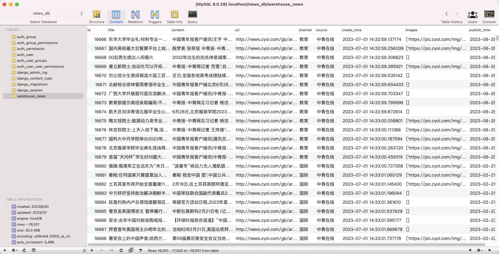

### 项目介绍
项目基于Scrapy实现，爬取新闻网站主要新闻，通过gen库提取内容，存储到mysql中。实现定时爬取和增量爬取。

##### 已爬取：

- 湖南在线
- 四月
- 四川新闻
- 广州日报大洋网
- 光明网
- 四川在线
- 东南网
- 中青在线
- 中评网
- 北晚在线
- 中国消费网
- 中国科技网
- 中国经济网
- 中国日报
- 中国交通新闻网
- 中国经济新闻网
- 中华网
- 文明网
- 南方网
- 中国新闻网




### 项目部署

数据模型通过Django ORM模型完成，使用前需要**导入数据库**或者**初始化**

##### 环境配置
请安装python3.8，然后执行：
```shell
pip install -r requirements.txt
#速度慢可以使用一下命令
pip install -i https://pypi.douban.com/simple/ -r requirements.txt
```


##### 数据库设置

/news_web/settings.py

```python
DATABASES = {
    "default": {
        "ENGINE": "django.db.backends.mysql",
        'OPTIONS': {
            'charset': 'utf8mb4',
        },
        "NAME": "数据库名",
        "USER": "用户",
        "PASSWORD": "密码",
        "HOST": "ip",
        "POST": 3306
    }
}
```

##### 导入数据库

```shell
source ./data_bak.sql
```


##### 初始化
如果导入了数据库这里可以不执行
```shell
python manage.py makemigrations
python manage.py migrate
```


### 项目运行

##### 直接运行

```shell
cd news_spider/
python main.py
```


##### 定时爬取
设置需要定时执行的时间
```python
# 使用schedule库来调度任务，在每天的2点执行run_crawler函数
schedule.every().day.at("02:00").do(run_crawler)
```

终端执行：
```shell
cd news_spider/
python main_timming.py
```


